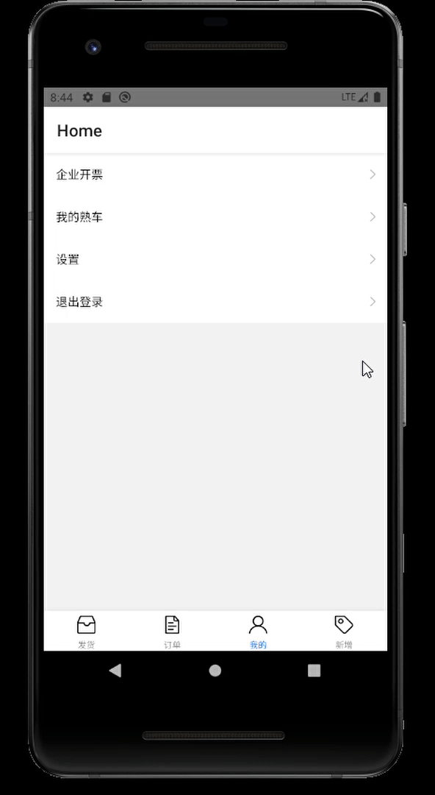

#### 完成效果如图



#### 模拟接口：

见mocker/user.mock.js

``` js
'GET /api/recommend': {
    msg:[
  {
      "title": "数字",
      "article": "123"
  },
  {
      "title":"字母",
      "article": "abc"
  },
  {
    "title":"汉字",
    "article": "abc"
}
]
```

#### 接口调用：

见src/page/MyHome/Recommend/index.js

````js
let res = await fetch('http://192.168.56.1:3721/api/recommend', {method: 'GET'});


export default connect(
  ({ data}) => ({
    rdata: data.msg,
  }),({data})=>({
    getdata: data.getdata,
  })
)(MyRecommend);

````

#### models：

见models/data.js

``` js
export default {
        state:{
            msg:[
                {
                    title:'一'
                },
                {
                    title:'二'
                }
            ],
        },
        reducers:{
            getdata(state, payload){
                console.log('调用了reduce')
                state.msg = payload
                return state
            },
            
        },
        
        }
```


